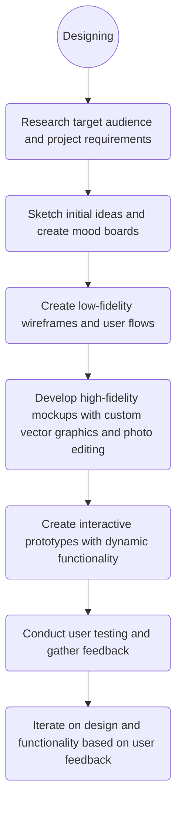
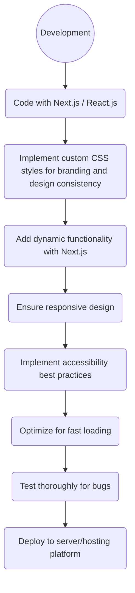

    

 As a detail-oriented designer and frontend developer, I enjoy collaborating with teams to produce outstanding results. 

 I'm currently part of a three-person frontend development team, and I recently led the UI/UX design for a project. I am excited to work with others who share my passion for creating exceptional products. Let's collaborate to bring your ideas to life.

-----

**You can reach me from the links below**

   &nbsp; &nbsp;&nbsp;&nbsp;&nbsp;&nbsp;&nbsp;&nbsp;&nbsp;&nbsp;&nbsp;&nbsp;&nbsp;&nbsp;&nbsp;    

# My Workflow

   
***In Designing Side*** 

  

***In Development Side***

